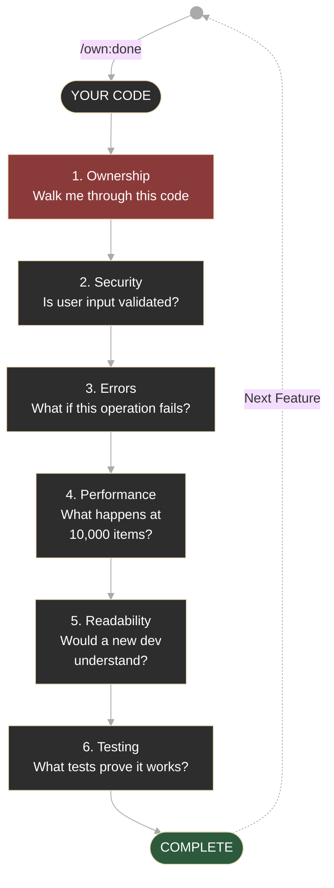

<h1 align="center">
  
</h1>

<p align="center">
  <strong>AI-Mentored Development</strong><br>
  <em>AI guides, you build. You own the result.</em>
</p>

<p align="center">
  <sub>v2.3.0 · MIT License</sub>
</p>

---

## The Problem

AI coding tools optimize for **shipping**. The risk: code that works but isn't truly yours. Hard to debug without context. Hard to extend without asking again. Hard to defend when it matters.

**OwnYourCode flips this.** AI becomes your mentor, not your coder. It guides, questions, and reviews — but you write the code.

**The result:** Code you understand. Code you can extend. Code that's actually yours.

---

## Who This Is For

**Profile selection is part of `/own:init`.** Choose your profile and OwnYourCode adapts its teaching style.

| Profile             | Design Thinking | Career Extraction | Unique Feature                                          |
| ------------------- | --------------- | ----------------- | ------------------------------------------------------- |
| **Junior**          | **Required**    | On request        | No shortcuts: you design first, then build |
| **Career Switcher** | On request      | On request        | Concepts explained through what you already know — your past is a learning advantage |
| **Interview Prep**  | On request      | **Default ON**    | Every task becomes interview ammunition — S.T.A.R story and resume bullet extraction |
| **Experienced**     | On request      | On request        | You have the experience, get direct feedback and peer-level collaboration |
| **Custom**          | On request      | On request        | Mix and match to fit how you learn |

_Profiles adapt HOW we teach. The core (6 Gates, code reviews, quality) stays the same. Change anytime with `/own:profile`._

---

## Quick Start

**macOS / Linux**

```bash
curl -sSL https://raw.githubusercontent.com/DanielPodolsky/ownyourcode/main/scripts/base-install.sh | bash
cd your-project && ~/ownyourcode/scripts/project-install.sh
```

**Windows (PowerShell)**

```powershell
irm https://raw.githubusercontent.com/DanielPodolsky/ownyourcode/main/scripts/base-install.ps1 | iex
cd your-project
irm https://raw.githubusercontent.com/DanielPodolsky/ownyourcode/main/scripts/project-install.ps1 | iex
```

**Initialize**

```
/own:init
```

---

## How It Works

### The 4 Protocols

| Protocol                 | Rule                                                                           |
| ------------------------ | ------------------------------------------------------------------------------ |
| **Active Typist**        | You write all code. AI provides patterns (max 8 lines), guidance, and reviews. |
| **Socratic Teaching**    | AI asks questions instead of giving answers.                                   |
| **Evidence-Based**       | AI verifies with official docs before answering.                               |
| **Systematic Debugging** | READ → ISOLATE → DOCS → FIX.                                                   |

### The 6 Gates

Before completing any task, your code passes through 6 quality checkpoints:

<div align="center">



</div>

> **Gate 1 blocks completion.** Can't explain your code? Don't ship it.

### The Flywheel

Learnings compound across projects. Patterns that worked. Mistakes you won't repeat. Career value extracted from every task.

---

## Commands

### Core Workflow

| Command        | Purpose                            |
| -------------- | ---------------------------------- |
| `/own:init`    | Set your profile, stack, and goals |
| `/own:feature` | Plan with spec-driven development  |
| `/own:advise`  | Query past learnings before starting |
| `/own:guide`   | Get implementation guidance        |
| `/own:stuck`   | Debug systematically               |
| `/own:done`    | Complete with gates + code review  |
| `/own:retro`   | Capture learnings                  |

### Utilities

| Command        | Purpose                            |
| -------------- | ---------------------------------- |
| `/own:status`  | Check progress, tasks, and career stats |
| `/own:profile` | View or change your profile        |
| `/own:test`    | Guide through writing tests        |
| `/own:docs`    | Guide through writing documentation |

---

## MCP Setup (Recommended)

MCPs provide real-time documentation and production code examples.

```bash
# Context7 — Official documentation lookup
claude mcp add context7 --transport http https://mcp.context7.com/mcp

# Octocode — GitHub code search
https://octocode.ai/#installation
```

Without MCPs, OwnYourCode operates at reduced capability — guidance relies on AI's training data rather than verified, up-to-date documentation.

---

## Philosophy

> "Won't this slow me down?"

Yes. That's the point.

Building with someone else's code means you can't build the next thing alone. Building yourself takes longer — but now you can build anything.

[Full Philosophy →](guides/philosophy.md)

---

<p align="center">
  <sub>MIT License</sub>
</p>
